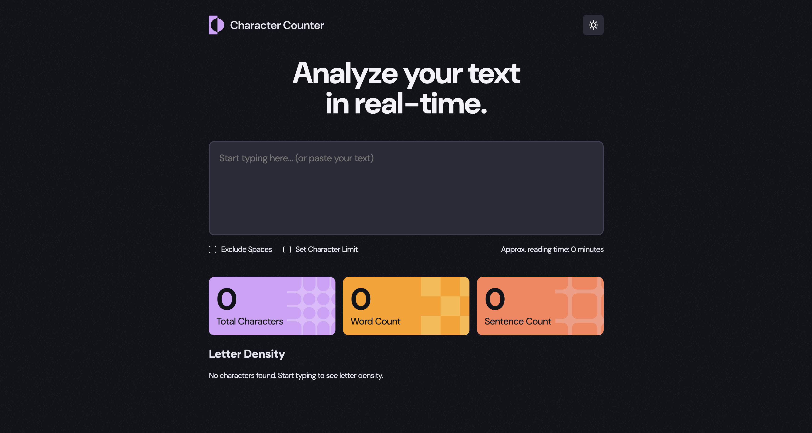

# Frontend Mentor - Character counter solution

This is a solution to the [Character counter challenge on Frontend Mentor](https://www.frontendmentor.io/challenges/character-counter-znSgeWs_i6). Frontend Mentor challenges help you improve your coding skills by building realistic projects. 

## Table of contents

- [Overview](#overview)
  - [The challenge](#the-challenge)
  - [Screenshot](#screenshot)
  - [Links](#links)
- [My process](#my-process)
  - [Built with](#built-with)
  - [What I learned](#what-i-learned)
- [Author](#author)

## Overview

### The challenge

Users should be able to:

- Analyze the character, word, and sentence counts for their text
- Exclude/Include spaces in their character count
- Set a character limit
- Receive a warning message if their text exceeds their character limit
- See the approximate reading time of their text
- Analyze the letter density of their text
- Select their color theme
- View the optimal layout for the interface depending on their device's screen size
- See hover and focus states for all interactive elements on the page

### Screenshot



### Links

- Solution URL: [https://github.com/hackz101/character-counter](https://github.com/hackz101/character-counter)
- Live Site URL: [https://character-counter-sand.vercel.app/](https://character-counter-sand.vercel.app/)

## My process

### Built with

- Semantic HTML5 markup
- CSS custom properties
- Flexbox
- CSS Grid
- Responsive Design
- [Normalize.css](https://necolas.github.io/normalize.css/) - For CSS resets

### What I learned

I learned a few things while doing this challenge:

- **Using a grid template column width of auto for it to fit the content**

```css
.theme-bar {
  display: grid;
  grid-template-columns: 1fr auto;
  ...
}
```

- **Using absolute positioning plus translation to get something to center when it must be absolutely positioned**
For example, if you had an icon that you needed to center on a specific point, you could set the absolute positions via top, right, bottom, or left and then transform translate by 50% to center the image. This works because the percentage on the transform relates to the image itself and not the parent.

```css
.checkbox:checked::after {
  content: "";
  position: absolute;
  width: 0.75rem;
  height: 0.75rem;
  top: 50%;
  left: 50%;
  transform: translate(-50%, -50%);
  ...
}
```

- **You can use nodeValue if you need to get the text only out of an element that also contains elements in certain cases**

```html
<p class="see-more">See more <i class="fa-solid fa-angle-down"></i></p>
```
```js
seeMore.firstChild.nodeValue = 'See less ';
```

- **You can calm theme flickering by inserting the javascript before the page fully loads**
I was running into a long flicker when loading a theme so I ended up moving the
javascript which fixed the issue mostly.

## Author

- Frontend Mentor - [@hackz101](https://www.frontendmentor.io/profile/hackz101)
